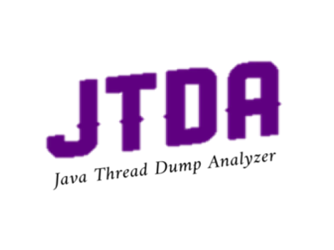
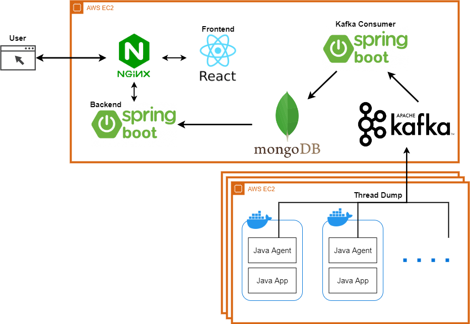

# JTDA - SSAFY X Kurly 기업연계 프로젝트
## JTDA (자바 프로세스 Thread Dump 수집/분석기)


### JTDA 소개 영상 📺


## 목차

- [주요 기능](#주요-기능)

- [빌드 및 배포 매뉴얼](#%EF%B8%8F-빌드-및-배포-매뉴얼)

- [서비스 화면](#-서비스-화면)

- [서비스 아키텍처](#서비스-아키텍처)

- [팀 E1I4](#팀-e1i4)

## ✨주요 기능

- 자바 프로세스의 Thread Dump를 실시간으로 저장 및 분석
- 특정 호스트의 특정 시간 Thread Dump 조회
- 특정 순간 혹은 기간의 Thread 상황 경향 그래프로 시각화

## 🖥️ 빌드 및 배포 매뉴얼

### 1. 버전

#### 1. JavaAgent

- JDK: `Oracle Open JDK version 1.8 `
- gradle: `7.4`
- dependencies
  - kafka-clients: `3.1.0`
  - json-simple: `1.1.1`
  - zstd-jni: `1.5.2-2`
  - lz4-java: `1.8.0`
  - slf4j-api: `1.7.36`
  - snappy-java: `1.1.8.4`

#### 2. Kafka server

- zookeeper: `3.4.13` (`wurstmeister/zookeeper: latest` docker image)
- kafka: `2.8.1` (`kafk-docker_kafka:latest` docker image)

#### 3. kafka consumer

- spring boot: `2.6.7`
- JDK: `Oracle Open JDK version 1.8 `
- gradle: `7.4.1`
- dependencies
  - spring-boot-starter-validation: `2.5.6`
  - gson: `2.7`
  - spring-boot-starter-data-mongodb: `2.6.7`
  - spring-kafka: `2.8.5`
  - spring-boot-starter: `2.6.7`
  - spring-boot-starter-test: `2.6.7`
  - lombok: `1.18.24`

#### 4. MongoDB

- mongo latest docker image

#### 5. Back-end

- spring-boot-
- dependencies
  - spring-boot-starter-data-mongodb: `2.6.7`
  - spring-boot-starter-web: `2.6.7`
  - lombok: `1.18.24`
  - spring-boot-starter-test: `2.6.7`
  - springfox-boot-starter: `3.0.0`
  - spring-plugin-core: `2.0.0`
  - spring-data-mongodb: `3.4.0`
  - mongo-java-driver: `3.12.11`
  - spring-data-commons: `2.7.0`

#### 6. Front-end

- react: `18.0.0`,
- typescript: `4.6.3`,
- styled-components: `5.3.5`,
- chart.js: `3.7.1`,
  - chartjs-chart-graph: `3.7.1`,
  - chartjs-plugin-datalabels: `2.0.0`,
  - chartjs-plugin-zoom: `1.2.1`,
- react-chartjs-2: `4.1.0`,
- date-fns: `2.28.0`,
- etc.. (`/frontend/package.json` 확인)

### 2. 빌드 시 주요 내용

#### 1. Java Agent

- 빌드 전, `com.ssafy.Agent` 의 아래 코드를 수정하여
  ```java
  private void sendThreadsDump(String payload) {
      // ...
      configs.put("bootstrap.servers", "kafkaServerAddress:port");
      // ...
  }
  ```
  - `"kakaServerAddress:port"` 대신 사용하는 kafka bootstrap-server 의 주소를 입력.
- gradle 로 `.jar` 빌드

#### 2. kafka server

- 프로젝트의 `/kafka-docker/docker-compose-single-broker.yml` 에서
  `ports`, `environment` 수정.
- docker-compose 를 사용하여 docker image 빌드

#### 3. kafka consumer

- `/src/main/resources/application.yml` 에서
  kafka bootstrap-server 주소 및 mongodb 접속 uri 수정.
- gradle 로 `.jar` 빌드

#### 4. Back-end

- `/backend/src/main/resources/application.properties`에  
  MongoDB 접속 정보, 사용할 Port 입력
- gradle 로 `.jar` 빌드
- 기본 Port: 8081
- 기본 Database: threaddump
- 기본 Collection: threaddump

#### 5. Front-end

- `/src/api/index.js` 의 요청 BASE URL 수정.
- `npm build` 명령어로 빌드

#### 6. MongoDB

- 샘플 데이터: `/exec/DB_Dump_Sample/threaddump(2022-05-18 120000~2022-05-18 130000).json`
- 2022-05-18 12:00:00 ~ 2022-05-18 13:00:00 사이의 Document 데이터
- MongoDB에 Import 하여 사용

## ✨ 서비스 화면

### 1. 메인 페이지

#### 1. 메인화면


#### 2. 조회할 시간 설정

- 시점 혹은 기간으로 조회하고 싶은 시간을 설정한다.


#### 3. 사이드바

- 2에서 조회한 시간 내에 존재하는 tag와 cluster 목록이 표시된다.
- Tag를 선택하면 해당 Tag를 가진 Host들만이 표시된다.
- Cluster 이름으로 검색할 수 있다.


#### 4. 조회할 Host 선택

- 조회할 Host를 선택하면 해당 Host들의 Thread 상태-시간 그래프가 우측에 표시된다.
- cluster를 선택하면 cluster에 속한 모든 Host가 선택된다.
- 각각의 Host는 선택/선택해제 가능하다.
- 그래프에서 특정 시점을 선택하면 해당 시점 Host들의 정보를 조회할 수 있다.


- Host 이름으로 검색하면 검색한 키워드를 가진 Host들이 선택된다
- Host 이름은 정규식으로도 검색이 가능하다.


#### 5. 각 Host의 Thread 정보

- 선택한 Host의 목록에서 thread 상태의 대략적인 정보를 조회할 수 있다.
- Host의 이름을 누르면 상세 정보를 조회할 수 있다.


- 조회하고 싶은 상태를 선택하면 해당 상태에 대한 상세 정보 페이지가 새창으로 열린다.
- 전체, Runnable, Blocked, Waiting, Timed_wating 상태 별 조회가 가능하다.
  

### 2. 상세페이지

#### 1. 전체화면


#### 2. Thread 이름 검색

- Thread 이름으로 검색이 가능하다.

#### 3. 조회할 Thread 선택

- Thread 목록에서 조회하고 싶은 Thread를 선택하면 해당 Thread의 위치로 화면이 이동된다


## ✨서비스 아키텍처



## 팀 E1I4

| 구분 | 이름   | 역할 |
| ---- | ------ | :-------: |
| 팀장 | 박지후 |           |
| 팀원 | 김종범 |           |
| 팀원 | 송지호 |           |
| 팀원 | 장효정 |           |
| 팀원 | 전현민 |           |

👉 [JTDA 노션](https://ssafykurlyproject.notion.site/6eba5de5281b4a25b986d94c63193ceb)
