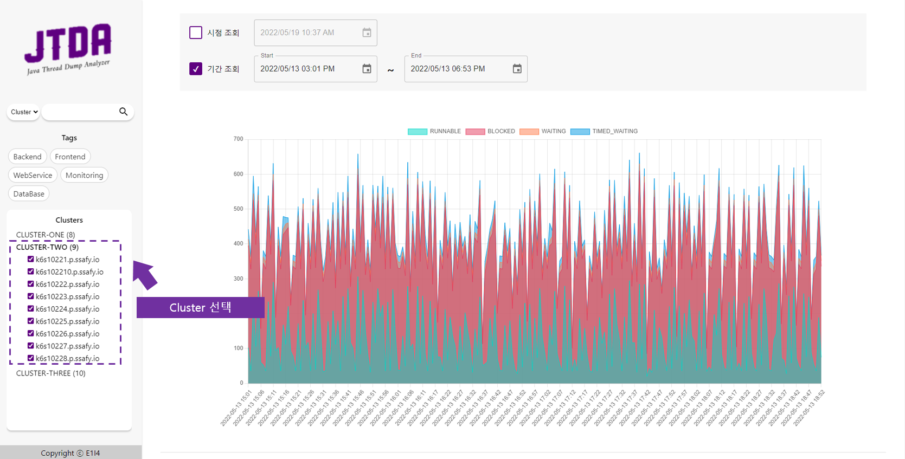
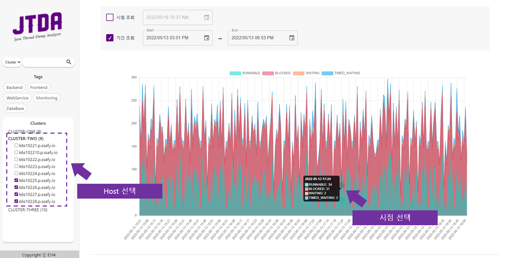
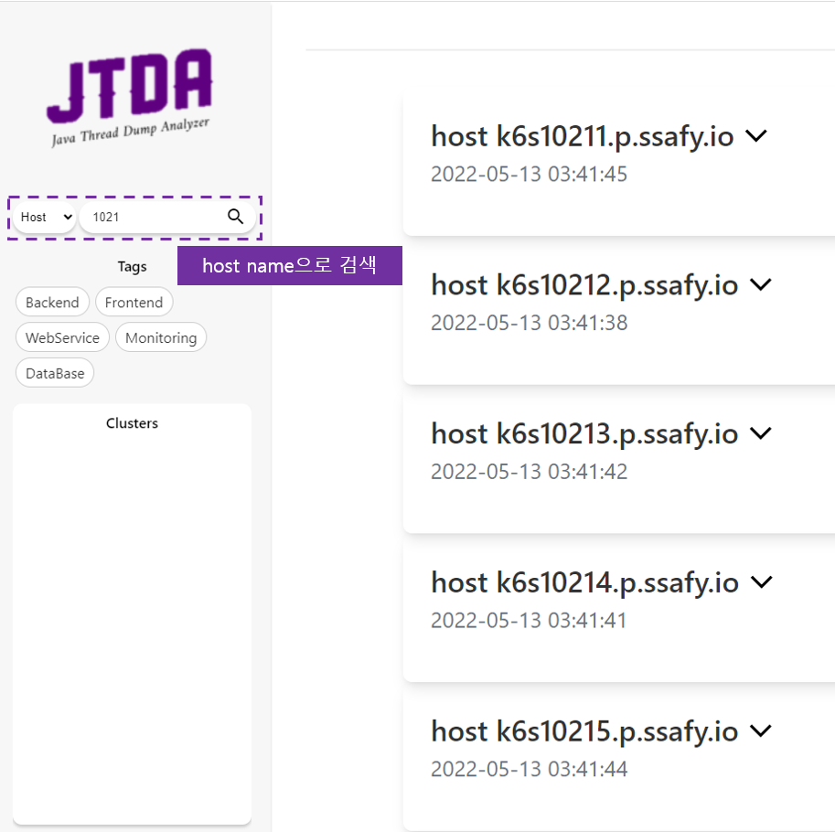
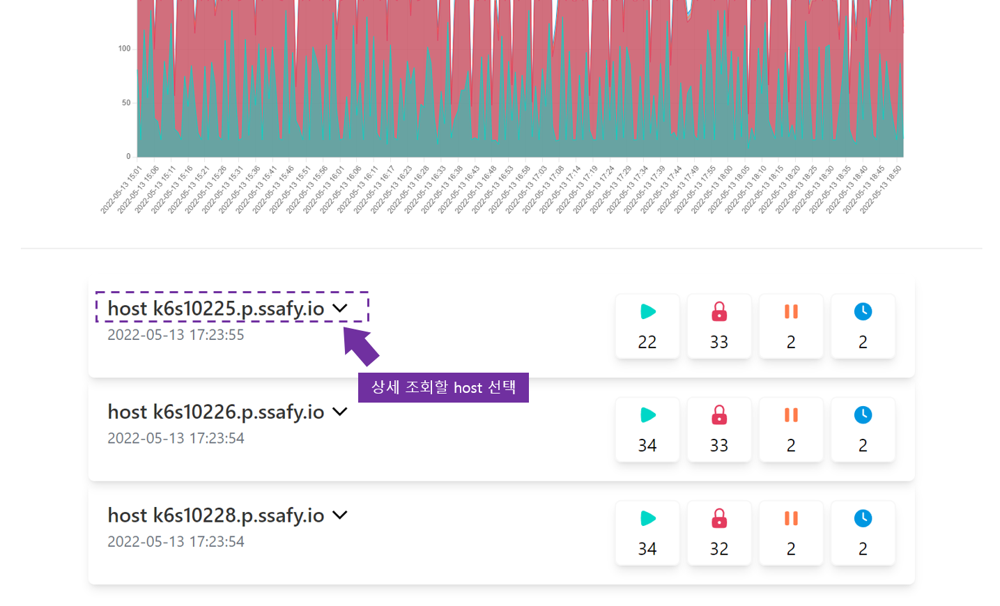
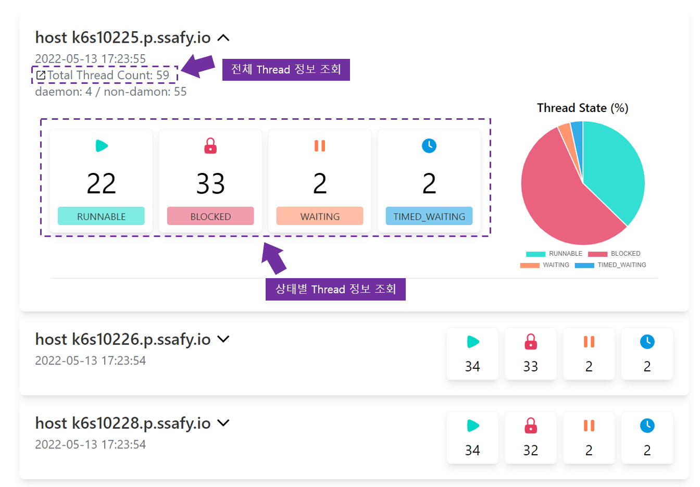
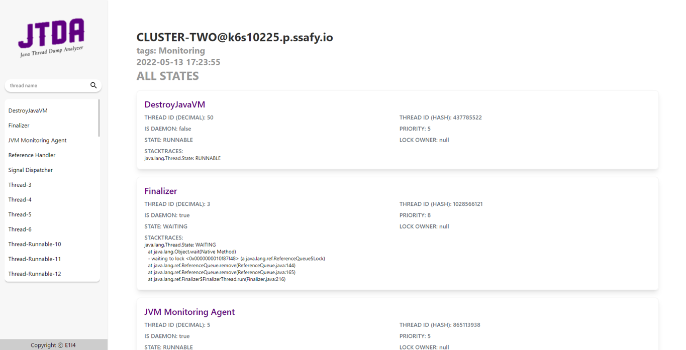
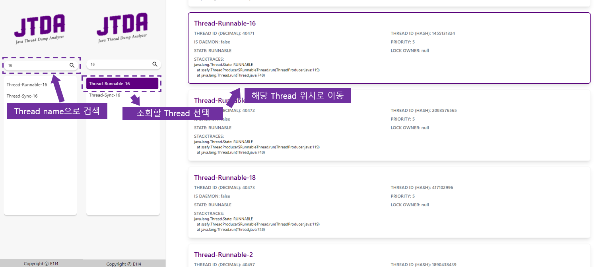

## 1. 메인 페이지
### 1. 메인화면

### 2. 조회할 시간 설정
- 시점 혹은 기간으로 조회하고 싶은 시간을 설정한다.

### 3. 사이드바
- 2에서 조회한 시간 내에 존재하는 tag와 cluster 목록이 표시된다.
- Tag를 선택하면 해당 Tag를 가진 Host들만이 표시된다.
- Cluster 이름으로 검색할 수 있다.

### 4. 조회할 Host 선택
- 조회할 Host를 선택하면 해당 Host들의 Thread 상태-시간 그래프가 우측에 표시된다.
- cluster를 선택하면 cluster에 속한 모든 Host가 선택된다.
- 각각의 Host는 선택/선택해제 가능하다.
- 그래프에서 특정 시점을 선택하면 해당 시점 Host들의 정보를 조회할 수 있다.

- Host 이름으로 검색하면 검색한 키워드를 가진 Host들이 선택된다
- Host 이름은 정규식으로도 검색이 가능하다.

### 5. 각 Host의 Thread 정보
- 선택한 Host의 목록에서 thread 상태의 대략적인 정보를 조회할 수 있다.
- Host의 이름을 누르면 상세 정보를 조회할 수 있다.

- 조회하고 싶은 상태를 선택하면 해당 상태에 대한 상세 정보 페이지가 새창으로 열린다.
- 전체, Runnable, Blocked, Waiting, Timed_wating 상태 별 조회가 가능하다.

## 2. 상세페이지
### 1. 전체화면

### 2. Thread 이름 검색
- Thread 이름으로 검색이 가능하다.

### 3. 조회할 Thread 선택
- Thread 목록에서 조회하고 싶은 Thread를 선택하면 해당 Thread의 위치로 화면이 이동된다

